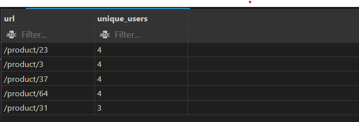
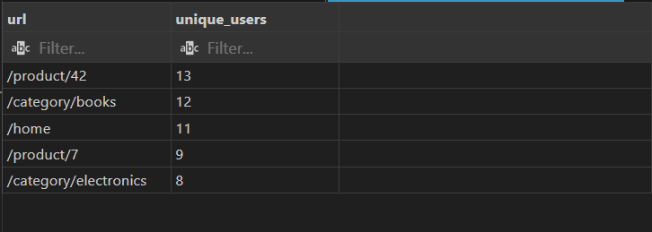

# Результати ТЗ на посаду Junior PHP Developer

**Виконав:** Погорілий Данило  

---

## Перше завдання

1. Спроектувати кращу схему (свій варіант у гілці feature/mysql-optimization): 
2. Оптимізувати 2 запити (наведені нижче) і показати до/після: 
    * A1. Топ‑5 сторінок за унікальними користувачами у діапазоні дат і 
країні. 
    * A2. Batch insert 100–1000 рядків за раз з порадами щодо швидкості (транзакції, INSERT ... VALUES (...) , (...), LOAD DATA - якщо доречно). 
3. Надати приклади SQL (ваш фінальний варіант) у README + короткий коментар чому саме так. 

---

## Початкова архітектура БД (погана схема)

```sql
CREATE DATABASE IF NOT EXISTS analytics_legacy; 
USE analytics_legacy; 

DROP TABLE IF EXISTS pv;  
CREATE TABLE pv ( 
    id INT NOT NULL AUTO_INCREMENT, 
    user_id INT NULL, 
    url VARCHAR(1024) NULL, 
    country VARCHAR(3) NULL, 
    device VARCHAR(16) NULL, 
    created_at VARCHAR(32) NULL,    
    duration_ms INT NULL,           
    PRIMARY KEY (id) 
) ENGINE=InnoDB; 

INSERT INTO pv (user_id, url, country, device, created_at, duration_ms) VALUES 
(1,'/product/42','UA','desktop','2025-09-15 10:11:12',350), 
(2,'/product/42','UA','mobile','2025-09-15 11:01:02',900), 
(1,'/home','PL','mobile','2025-09-16 08:21:00',120), 
(3,'/product/7','UA','desktop','2025-09-16 09:01:00',220);
```

**Проблеми цієї схеми:**

* url зберігається як текст, це ускладнює пошук і групування по сторінках.

* device зберігається як текст, призводячи до дублювання данних.

* created_at у VARCHAR замість DATETIME.

* Відсутні індекси для швидких вибірок.

* Не знаходться БД у 3 нормальній формі.

---

## Оптимізована архітектура БД
```sql
CREATE DATABASE IF NOT EXISTS analytics_opt;
USE analytics_opt;

-- Таблиця сторінок (нормалізація URL)
DROP TABLE IF EXISTS pages;
CREATE TABLE pages (
    id INT UNSIGNED NOT NULL AUTO_INCREMENT, 
    url_hash CHAR(32) NOT NULL,
    url_text VARCHAR(1024) NOT NULL,
    created_at DATETIME NULL,
    PRIMARY KEY (id),
    UNIQUE KEY uk_pages_urlhash (url_hash),
    INDEX idx_pages_urlprefix (url_text(255))
) ENGINE=InnoDB ROW_FORMAT=DYNAMIC;

DROP TABLE IF EXISTS device_lookup;
CREATE TABLE device_lookup (
  id TINYINT UNSIGNED NOT NULL PRIMARY KEY,
  name VARCHAR(32) NOT NULL,
  UNIQUE KEY uk_device_name (name)
) ENGINE=InnoDB;

INSERT IGNORE INTO device_lookup (id, name) VALUES
(1,'desktop'), (2,'mobile'), (3,'tablet'), (4,'other');

DROP TABLE IF EXISTS pv_events;
CREATE TABLE pv_events (
  id BIGINT UNSIGNED NOT NULL AUTO_INCREMENT,
  user_id INT UNSIGNED NULL,
  page_id INT UNSIGNED NOT NULL,
  country CHAR(2) NOT NULL,
  device_id TINYINT UNSIGNED NULL,
  created_at DATETIME NOT NULL,
  duration_ms INT UNSIGNED NULL,
  PRIMARY KEY (id),
  INDEX idx_country_created_page (country, created_at, page_id),
  INDEX idx_page_created (page_id, created_at),
  INDEX idx_user_created (user_id, created_at),
  INDEX idx_created (created_at),
  CONSTRAINT fk_pv_page FOREIGN KEY (page_id) REFERENCES pages(id) ON DELETE RESTRICT
) ENGINE=InnoDB ROW_FORMAT=DYNAMIC;
```

**Переваги нової схеми:**

* URL зберігається у таблиці pages з унікальним хешем.

* Винісши device у окрему таблицю тим самим прибравши дублювання даних.

* created_at у DATETIME.

* Додані індекси для швидких запитів по країні, сторінці та користувачу.

---

## A1. Топ‑5 сторінок за унікальними користувачами у діапазоні дат і країні.
### Було:
```sql
SELECT 
    pv.url, 
    COUNT(DISTINCT pv.user_id) AS unique_users
FROM analytics_legacy.pv
WHERE STR_TO_DATE(pv.created_at, '%Y-%m-%d %H:%i:%s') 
          BETWEEN '2025-09-14 00:00:00' AND '2025-09-16 23:59:59'
  AND pv.country = 'UA'
GROUP BY pv.url
ORDER BY unique_users DESC
LIMIT 5;
```
Працював зі строками які переводили у дату.


### Стало:
```sql
SELECT p.url_text AS url,
       t.unique_users
FROM (
  SELECT page_id, COUNT(*) AS unique_users
  FROM (
    SELECT page_id, user_id
    FROM analytics_opt.pv_events
    WHERE country = 'UA'
      AND created_at BETWEEN '2025-09-15 00:00:00' AND '2025-09-18 23:59:59'
    GROUP BY page_id, user_id
  ) su
  GROUP BY page_id
  ORDER BY unique_users DESC
  LIMIT 5
) t
JOIN analytics_opt.pages p ON p.id = t.page_id;
```
Використання індексів для швидкої фільтрації. Використання підзапитів.

---
## A2. Batch insert 100–1000 рядків за раз з порадами щодо швидкості (транзакції, INSERT ... VALUES (...) , (...), LOAD DATA - якщо доречно)
Для legacy та optymized я використовува вставку з використанням **транзакцій** та **INSERT ... VALUEA (...)**. Для цього я створював окремо PHP файл з підключенням до БД через PDO з обробкою помилок та отриманням даних у вигляді асоціативного масиву

У першому випадку (legacy) я передав 500 рядків розбиваючи на 100 батчів. У іншому (optimized) випадку 1000 рядків по 200 батчів.

#### Основна логіка:
```php
$pdo->beginTransaction();
    for ($i = 0; $i < count($rows); $i += $batchSize) {
        $batch = array_slice($rows, $i, $batchSize);

        $placeholders = [];
        $values = [];
        foreach ($batch as $row) {
            $placeholders[] = "(?, ?, ?, ?, ?, ?)";
            $values = array_merge($values, $row);
        }

        $sql = "INSERT INTO pv_events (user_id, page_id, country, device_id, created_at, duration_ms) 
                VALUES ".implode(',', $placeholders);
        $stmt = $pdo->prepare($sql);
        $stmt->execute($values);
    }
$pdo->commit();
```
---
